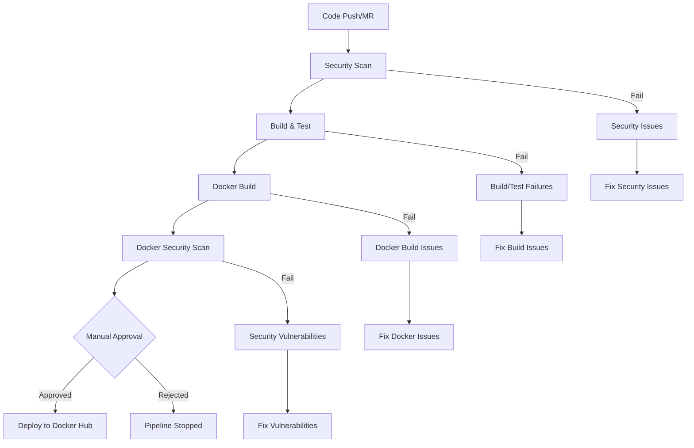

# GitLab CI/CD Pipeline Flow Documentation

## Overview

This document describes the GitLab CI/CD pipeline flow for the MERN Stack DevOps Showcase Project. The pipeline is designed to provide comprehensive testing, security scanning, and deployment capabilities.

## Pipeline Stages

The pipeline consists of 6 main stages executed in sequence:

```
security → build → test → docker-build → docker-security → deploy
```

## Stage Details

### 1. Security Stage (`security`)

**Purpose**: Static Application Security Testing (SAST) and dependency scanning

**Jobs**:
- `security_scan`: Scans code for security vulnerabilities
- `sast_scan`: Static Application Security Testing
- `dependency_scan`: Scans dependencies for known vulnerabilities

**Tools Used**:
- npm audit
- Snyk CLI
- Retire.js

**Triggers**:
- Merge requests
- Main branch commits

### 2. Build Stage (`build`)

**Purpose**: Compile and build the application components

**Jobs**:
- `build_and_test`: Builds backend and frontend applications
- `backend_build_test`: Backend-specific build and test
- `frontend_build_test`: Frontend-specific build and test
- `integration_tests`: Cross-component integration testing
- `docker_build_test`: Docker build validation
- `code_quality`: Code linting and quality checks

**Artifacts Generated**:
- Backend: `application/backend/dist/`
- Frontend: `application/frontend/.next/` and `application/frontend/out/`
- Test reports: JUnit XML files
- Coverage reports

### 3. Test Stage (`test`)

**Purpose**: Comprehensive testing of all application components

**Test Categories**:
- **Backend Tests**: API endpoints, authentication, business logic
- **Frontend Tests**: Component rendering, user interactions
- **Integration Tests**: End-to-end user flows
- **Docker Tests**: Container build and runtime validation

**Services Required**:
- MongoDB (for integration tests)
- Redis (for caching tests)

### 4. Docker Build Stage (`docker-build`)

**Purpose**: Build and push Docker images to GitLab Container Registry

**Jobs**:
- `build_backend_image`: Builds backend Docker image
- `build_frontend_image`: Builds frontend Docker image

**Image Tags**:
- `$CI_COMMIT_SHA`: Specific commit version
- `latest`: Latest stable version

**Registry**: GitLab Container Registry

### 5. Docker Security Stage (`docker-security`)

**Purpose**: Security scanning of Docker images

**Jobs**:
- `scan_backend_image`: Security scan of backend image
- `scan_frontend_image`: Security scan of frontend image

**Security Tools**:
- **Trivy**: Vulnerability scanning
- **Snyk**: Container security analysis
- **Docker Scout**: Docker Hub security scanning

**Reports Generated**:
- JSON vulnerability reports
- Security summary reports
- High-severity vulnerability alerts

### 6. Deploy Stage (`deploy`)

**Purpose**: Deploy images to Docker Hub (manual trigger)

**Jobs**:
- `deploy_to_docker_hub`: Deploy to Docker Hub registry

**Prerequisites**:
- Docker Hub credentials configured
- Security scans passed
- Manual approval required

## Pipeline Triggers

### Automatic Triggers
- **Merge Requests**: Full pipeline execution
- **Main Branch**: Full pipeline execution
- **Feature Branches**: Security and build stages only

### Manual Triggers
- **Docker Hub Deployment**: Requires manual approval
- **Multi-architecture Builds**: Optional manual trigger

## Required Variables

### GitLab CI/CD Variables (Set in Project Settings)

```bash
# Docker Hub Authentication
DOCKER_HUB_USERNAME=your-dockerhub-username
DOCKER_HUB_TOKEN=your-dockerhub-access-token

# GitLab Container Registry (Auto-provided)
CI_REGISTRY=registry.gitlab.com
CI_REGISTRY_USER=gitlab-ci-token
CI_REGISTRY_PASSWORD=auto-generated
CI_REGISTRY_IMAGE=your-project/your-repo
```

### Environment Variables for Tests

```bash
# Backend Configuration
BACKEND_URL=http://localhost:3000
MONGODB_URI=mongodb://localhost:27017/ticketnow-test
REDIS_URL=redis://localhost:6379
JWT_SECRET=your-jwt-secret

# Frontend Configuration
FRONTEND_URL=http://localhost:3001
NEXT_PUBLIC_API_URL=http://localhost:3000
```

## Pipeline Flow Diagram



## Artifacts and Reports

### Build Artifacts
- **Backend**: Compiled TypeScript to JavaScript
- **Frontend**: Next.js build output
- **Tests**: Coverage reports and test results

### Security Reports
- **SAST**: Static analysis security reports
- **Dependency**: Vulnerability scan results
- **Container**: Docker image security reports

### Test Reports
- **JUnit**: Test execution results
- **Coverage**: Code coverage metrics
- **Integration**: End-to-end test results

## Pipeline Configuration Files

### Main Configuration
- `gitlab-ci/.gitlab-ci.yml`: Main pipeline configuration

### Template Files
- `templates/security-scan.yml`: Security scanning templates
- `templates/build-and-test.yml`: Build and test templates
- `templates/docker-build.yml`: Docker build templates
- `templates/docker-security.yml`: Docker security templates

## Monitoring and Notifications

### Pipeline Status
- **Success**: All stages completed successfully
- **Failed**: Any stage failed
- **Manual**: Waiting for manual approval
- **Skipped**: Stage conditions not met

### Notifications
- **Email**: Pipeline status notifications
- **Slack**: Team notifications (if configured)
- **GitHub**: Status checks (if integrated)

## Troubleshooting

### Common Issues

1. **Build Failures**
   - Check Node.js version compatibility
   - Verify all dependencies are installed
   - Review build logs for specific errors

2. **Test Failures**
   - Ensure test services (MongoDB, Redis) are available
   - Check test environment variables
   - Review test timeout settings

3. **Docker Build Issues**
   - Verify Dockerfile syntax
   - Check base image availability
   - Review build context and resources

4. **Security Scan Failures**
   - Address high-severity vulnerabilities
   - Update dependencies with known issues
   - Review security scan reports

### Debug Commands

```bash
# Check pipeline status
gitlab-ci-multi-runner status

# View pipeline logs
gitlab-ci-multi-runner logs

# Test pipeline locally
gitlab-runner exec docker security_scan
```

## Best Practices

### Security
- Regular dependency updates
- Security scan integration
- Vulnerability remediation
- Secure credential management

### Performance
- Parallel job execution
- Efficient caching strategies
- Resource optimization
- Build time monitoring

### Reliability
- Comprehensive testing
- Error handling
- Rollback procedures
- Monitoring and alerting

## Pipeline Optimization

### Caching Strategy
- Node modules caching
- Docker layer caching
- Build artifact caching
- Test result caching

### Parallel Execution
- Independent job execution
- Resource allocation
- Load balancing
- Queue management

### Resource Management
- Memory limits
- CPU allocation
- Storage optimization
- Network efficiency

## Maintenance

### Regular Tasks
- Update base images
- Review security reports
- Optimize build times
- Monitor resource usage

### Monitoring
- Pipeline performance metrics
- Success/failure rates
- Build time trends
- Resource utilization

### Documentation Updates
- Keep pipeline documentation current
- Update troubleshooting guides
- Maintain best practices
- Document new features
