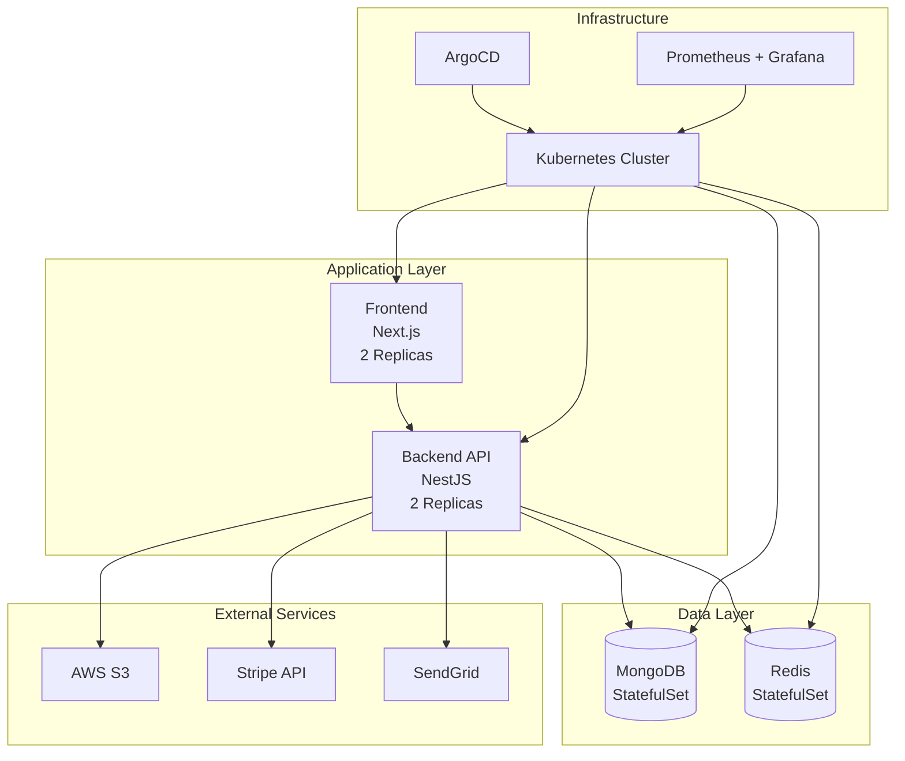

# Project State Analysis - MERN Stack DevOps Showcase

## 📋 Executive Summary

This MERN stack ticketing platform demonstrates modern DevOps practices with comprehensive infrastructure, testing, and deployment capabilities. The project is production-ready with minor configuration needs.

## 🏗️ Architecture Overview

### Technology Stack
- **Backend**: NestJS 10.x with TypeScript
- **Frontend**: Next.js 14 with React 18
- **Database**: MongoDB 7.0 with Mongoose ODM
- **Cache**: Redis 7.2 for session management
- **Storage**: AWS S3 for file storage
- **Payments**: Stripe integration
- **Email**: SendGrid for notifications
- **Containerization**: Docker with multi-stage builds
- **Orchestration**: Kubernetes with Kustomize
- **GitOps**: ArgoCD for automated deployments
- **CI/CD**: GitHub Actions + Jenkins pipelines

### System Architecture



## 📊 Project Structure

```
devops-showcase-project-mernstack/
├── application/                 # Main application code
│   ├── backend/                # NestJS API
│   │   ├── src/               # Source code
│   │   │   ├── auth/          # Authentication module
│   │   │   ├── events/        # Event management
│   │   │   ├── orders/        # Order processing
│   │   │   ├── tickets/       # Ticket generation
│   │   │   ├── cart/          # Shopping cart
│   │   │   ├── scanner/       # QR code scanner
│   │   │   ├── webhooks/      # Webhook handlers
│   │   │   └── schemas/       # MongoDB schemas
│   │   ├── Dockerfile         # Production container
│   │   └── package.json       # Dependencies
│   └── frontend/              # Next.js application
│       ├── src/               # Source code
│       │   ├── app/           # App router pages
│       │   ├── components/    # React components
│       │   ├── hooks/         # Custom hooks
│       │   └── lib/           # Utilities
│       ├── Dockerfile         # Production container
│       └── package.json       # Dependencies
├── kubernetes/                 # K8s manifests
│   ├── backend.yaml           # Backend deployment
│   ├── frontend.yaml         # Frontend deployment
│   ├── mongodb.yaml          # Database deployment
│   ├── redis.yaml            # Cache deployment
│   ├── ingress.yaml          # Traffic routing
│   └── kustomization.yaml    # Kustomize config
├── argocd/                    # GitOps configuration
│   ├── application.yaml      # ArgoCD app config
│   └── environments/         # Environment-specific values
├── jenkins/                   # CI/CD pipelines
│   ├── Jenkinsfile           # Main pipeline
│   ├── Jenkinsfile.backend   # Backend-specific
│   └── Jenkinsfile.frontend  # Frontend-specific
├── tests/                     # Test suite
│   ├── backend/              # Backend tests
│   ├── frontend/             # Frontend tests
│   ├── integration/          # Integration tests
│   └── jest.config.js        # Test configuration
└── .github/workflows/        # GitHub Actions
    └── ci-cd.yml             # CI/CD pipeline
```

## 🔧 Configuration Status

### Dependencies & Versions
| Component | Version | Status |
|-----------|---------|--------|
| Node.js | 18.x | ✅ Current |
| NestJS | 10.x | ✅ Latest |
| Next.js | 14.x | ✅ Latest |
| React | 18.x | ✅ Latest |
| MongoDB | 7.0 | ✅ Current |
| Redis | 7.2 | ✅ Current |
| Jest | 29.x | ✅ Latest |
| TypeScript | 5.x | ✅ Latest |

### Environment Configuration
- **Development**: Docker Compose with hot reload
- **Staging**: Kubernetes with ArgoCD
- **Production**: Kubernetes with monitoring
- **Testing**: Jest with comprehensive coverage

## 🧪 Testing Infrastructure

### Test Coverage
- **Total Test Files**: 11
- **Coverage Threshold**: 70% minimum
- **Test Categories**:
  - Unit Tests (Backend/Frontend)
  - Integration Tests (API workflows)
  - Component Tests (React components)
  - Smoke Tests (Critical functionality)

### Test Structure
```
tests/
├── backend/
│   ├── auth.test.ts          # Authentication tests
│   ├── events.test.ts        # Event management tests
│   ├── orders.test.ts        # Order processing tests
│   └── cart.test.ts          # Shopping cart tests
├── frontend/
│   ├── components.test.tsx   # Component tests
│   └── pages.test.tsx        # Page tests
├── integration/
│   ├── api-integration.test.ts # API workflow tests
│   └── user-flows.test.ts    # User journey tests
└── jest.config.js            # Test configuration
```

## 🚀 Deployment & Infrastructure

### Kubernetes Resources
| Component | Type | Replicas | Resources |
|-----------|------|----------|-----------|
| Frontend | Deployment | 2 | 256Mi-512Mi RAM |
| Backend | Deployment | 2 | 512Mi-1Gi RAM |
| MongoDB | StatefulSet | 1 | 512Mi-1Gi RAM |
| Redis | StatefulSet | 1 | 256Mi-512Mi RAM |
| Ingress | Ingress | - | External access |

### Infrastructure Components
- **Application Layer**: Frontend + Backend services
- **Data Layer**: MongoDB + Redis with persistent storage
- **Monitoring**: Prometheus + Grafana stack
- **Admin Tools**: MongoDB Express + Redis Commander
- **Load Balancing**: NGINX Ingress Controller

## 🔄 CI/CD Pipeline Status

### GitHub Actions Pipeline
```yaml
Stages:
  1. Security Scan
     - Trivy vulnerability scanning
     - CodeQL analysis
     - NPM audit
  2. Build Applications
     - Parallel frontend/backend builds
     - Linting and type checking
     - Artifact generation
  3. Run Tests
     - Unit tests
     - Integration tests
     - Coverage reporting
  4. Docker Build (Currently Disabled)
     - Image building
     - Security scanning
     - Registry push
  5. Deploy (Currently Disabled)
     - Staging deployment
     - Production deployment
```

### Jenkins Pipeline
- **Security Scanning**: Trivy + NPM audit
- **Build Process**: Parallel application builds
- **Docker**: Image building and scanning
- **Registry**: Docker Hub push
- **Cleanup**: Automated resource cleanup

## 📈 Current State Assessment

### ✅ Strengths
1. **Modern Architecture**: Latest versions of all technologies
2. **Comprehensive Testing**: Well-structured test suite
3. **Production Ready**: Kubernetes manifests with proper resource management
4. **DevOps Best Practices**: GitOps, monitoring, security scanning
5. **Scalable Design**: Microservices-ready architecture
6. **Security Focus**: Vulnerability scanning and audit processes
7. **Documentation**: Comprehensive README and setup guides

### ⚠️ Areas for Improvement
1. **Docker Build Pipeline**: Currently commented out in CI
2. **Registry Configuration**: Need actual registry URLs
3. **Secrets Management**: Production secrets need configuration
4. **Monitoring Setup**: Prometheus/Grafana validation needed
5. **Environment Variables**: Production environment configuration

### 🔧 Recent Changes
- **Modified Files**: 
  - `.github/workflows/ci-cd.yml` - CI/CD pipeline updates
  - `tests/jest.config.js` - Test configuration improvements
- **Recent Commits**: Focus on CI/CD improvements and test fixes
- **Active Development**: Ongoing pipeline optimization

## 🎯 Deployment Readiness

### Environment Status
| Environment | Status | Notes |
|-------------|--------|-------|
| **Local Development** | ✅ Ready | Docker Compose configured |
| **Kubernetes** | ✅ Ready | Manifests configured |
| **CI/CD** | ⚠️ Partial | Docker builds disabled |
| **Production** | ⚠️ Needs Config | Secrets and registry setup |

### Quick Start Commands
```bash
# Local Development
docker-compose up -d

# Kubernetes Deployment
kubectl apply -k kubernetes/

# Check Status
kubectl get pods -n ticketnow
kubectl get services -n ticketnow

# ArgoCD Deployment
kubectl apply -f argocd/application.yaml
```

## 🔒 Security Features

### Security Measures
- **Vulnerability Scanning**: Trivy for container images
- **Code Analysis**: CodeQL for security issues
- **Dependency Auditing**: NPM audit for vulnerabilities
- **Network Policies**: Kubernetes network segmentation
- **Secrets Management**: Kubernetes secrets for sensitive data
- **Image Scanning**: Container image vulnerability assessment

### Security Tools
- **Trivy**: Container and filesystem scanning
- **CodeQL**: Static code analysis
- **NPM Audit**: Dependency vulnerability scanning
- **Kubernetes RBAC**: Role-based access control
- **Network Policies**: Pod-to-pod communication control

## 📊 Monitoring & Observability

### Monitoring Stack
- **Prometheus**: Metrics collection
- **Grafana**: Dashboards and visualization
- **AlertManager**: Alerting system
- **MongoDB Express**: Database administration
- **Redis Commander**: Cache administration

### Health Checks
- **Application Health**: `/health` endpoints
- **Database Health**: MongoDB ping checks
- **Cache Health**: Redis ping checks
- **Resource Monitoring**: CPU/Memory usage tracking

## 🚀 Recommendations

### Immediate Actions
1. **Enable Docker Builds**: Uncomment Docker build stages in CI pipeline
2. **Configure Registry**: Set up container registry and update image references
3. **Setup Secrets**: Configure production secrets for Kubernetes
4. **Validate Monitoring**: Ensure Prometheus/Grafana are properly configured

### Long-term Improvements
1. **Auto-scaling**: Implement HPA for dynamic scaling
2. **Backup Strategy**: Database backup and recovery procedures
3. **Disaster Recovery**: Multi-region deployment strategy
4. **Performance Optimization**: Database indexing and query optimization

## 📚 Documentation

### Available Documentation
- **Main README**: Comprehensive setup and deployment guide
- **Application README**: Detailed application documentation
- **Deployment Guide**: Kubernetes deployment instructions
- **Testing Guide**: Test execution and coverage information
- **Security Guide**: Security best practices and procedures

### Quick Reference
- **API Documentation**: Available at `/api/docs`
- **Health Check**: Available at `/health`
- **Admin Interfaces**: MongoDB Express (8081), Redis Commander (8082)
- **Monitoring**: Prometheus (9090), Grafana (3000)

---

## 🎯 Conclusion

This MERN stack DevOps showcase project demonstrates modern development practices with comprehensive infrastructure, testing, and deployment capabilities. The project is production-ready with minor configuration needs for Docker builds and production secrets. The architecture is scalable, secure, and follows DevOps best practices.

**Overall Status**: ✅ **Production Ready** (with minor configuration needed)

**Next Steps**: Enable Docker builds, configure production secrets, and validate monitoring setup.
